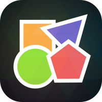
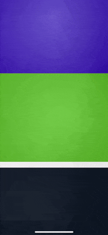

<h1 align="center">FityIt - The shapes game</h1>

 

  
   

## About
How long can you survive in FityIt? Focus is key to achieving a high score!
Tap left or right to spin the octagon and match the incoming shapes.

FityIt is a challenging game of skill and reflexes. Not only does this game test your reaction time, is super fun, addictive and FREE.

Share and challenge your friends!

Easy to learn, hard to master. How far can you go?

## Running
Open `FityIt.xcproject`, change the bundle identifier to an identifier linked to your Apple developer account in order to run. Build using the `FityIt` scheme. 

## License

This project is available under the MIT license. See the LICENSE file for more info.